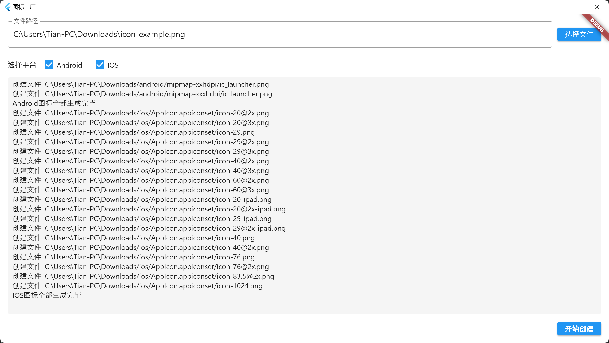
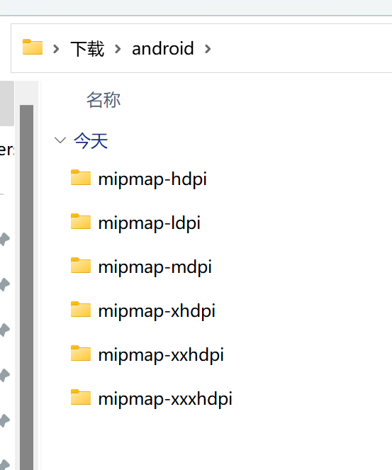
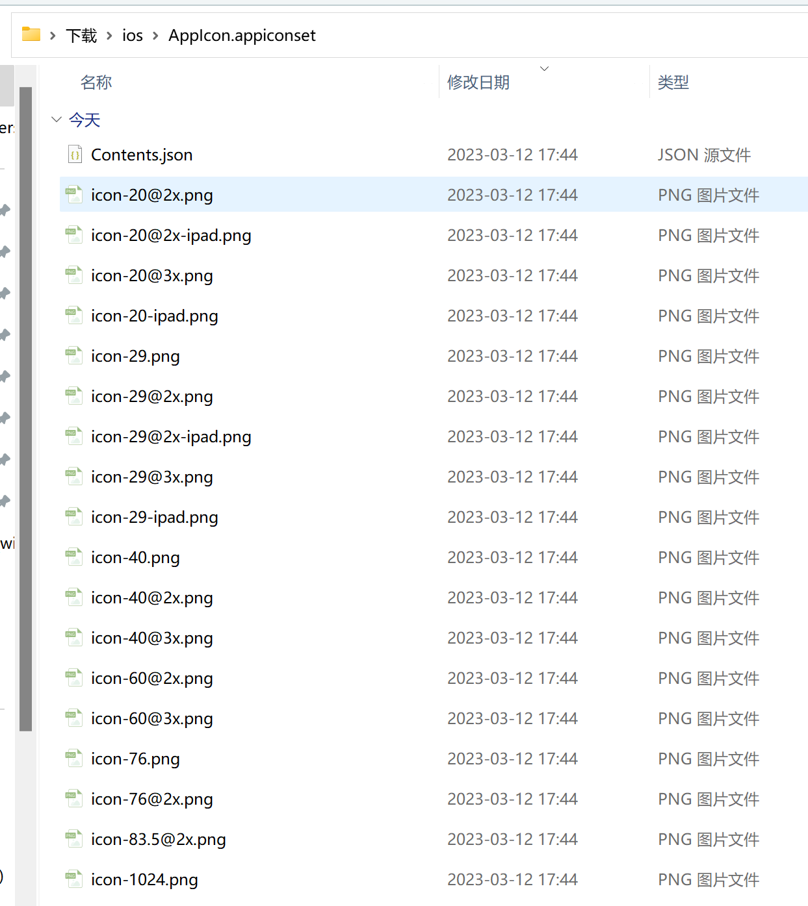

# create_icon

* 一键创建APP桌面图标，输入1024x1024的圆角图，输出android图片和ios图标。 
Create APP desktop icons with one click, input 1024x1024 rounded images, output android images and ios icons.  
* 支持的平台：Windows、macOS   
Supported platforms: Windows, macOS

# 自定义（Custom）

* 1、Android图标修改`assets/android.json`文件 
  Android icon modification `assets/android.json` file  
* 2、IOS图标修改`assets/ios.json`文件 
  IOS icon modification `assets/ios.json` file  

## 示例图

